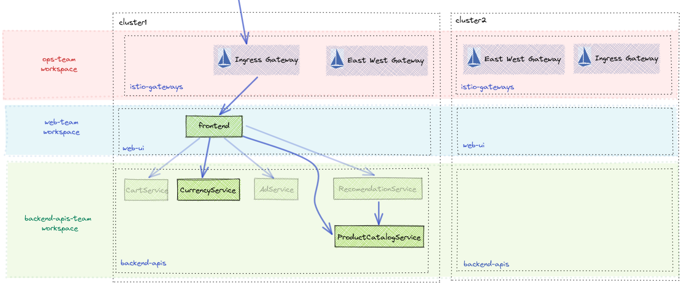
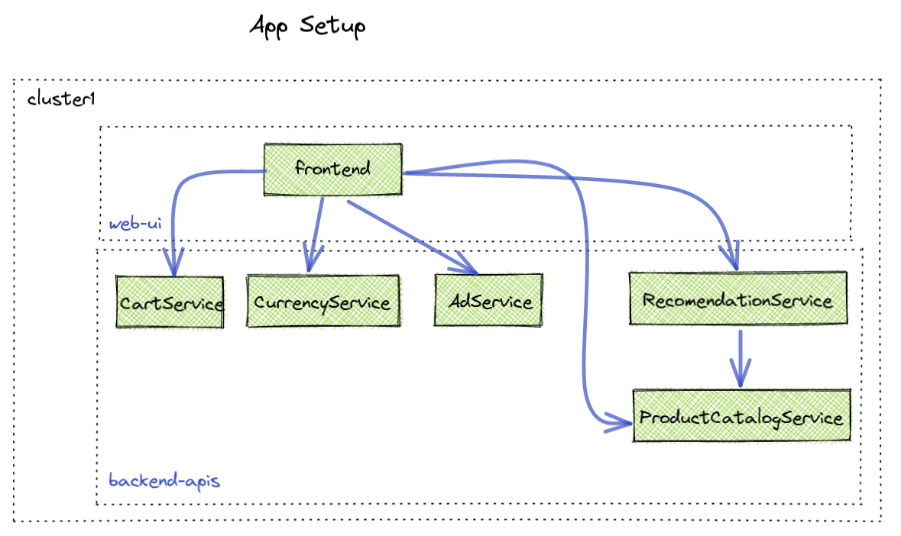
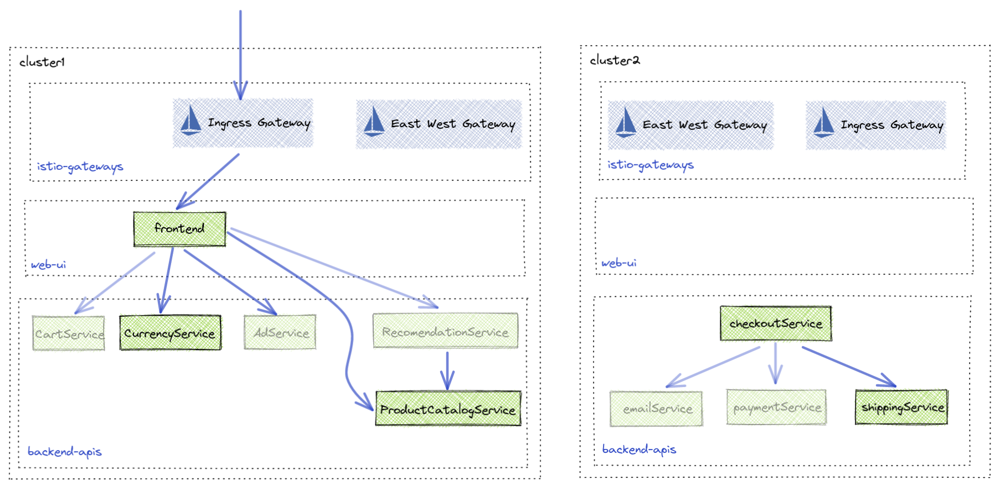

<!--bash
#!/usr/bin/env bash

#source ./scripts/assert.sh
-->


# <center>Gloo Mesh Workshop</center>

## Table of Contents
* [Introduction](#introduction)
* [Lab 1 - Environment Setup](#Lab-1)
* [Lab 2 - Workspaces](#Lab-2)
* [Lab 3 - Expose Frontend](#Lab-3)
* [Lab 4 - Multi-cluster Routing](#Lab-4)
* [Lab 5 - Policies](#Lab-5)

```sh

export MGMT_CLUSTER=mgmt
export REMOTE_CLUSTER1=cluster1
export REMOTE_CLUSTER2=cluster2

export MGMT_CONTEXT=mgmt
export REMOTE_CONTEXT1=cluster1
export REMOTE_CONTEXT2=cluster2

export ISTIO_REPO=gcr.io/istio-release
export ISTIO_VERSION=1.12.6

export GLOO_MESH_VERSION=v2.0.0-beta30

curl -sL https://run.solo.io/meshctl/install | GLOO_MESH_VERSION=${GLOO_MESH_VERSION} sh -

meshctl install \
  --kubecontext $MGMT_CONTEXT \
  --license $GLOO_MESH_LICENSE_KEY \
  --version $GLOO_MESH_VERSION \
  --set mgmtClusterName=$MGMT_CLUSTER

#  --set glooMeshMgmtServer.image.registry=gcr.io/solo-test-236622 \
#  --set glooMeshMgmtServer.image.tag=2.0.0-beta28-3-gf1fbadcb3

MGMT_SERVER_NETWORKING_DOMAIN=$(kubectl get svc -n gloo-mesh gloo-mesh-mgmt-server --context $MGMT_CONTEXT -o jsonpath='{.status.loadBalancer.ingress[0].ip}')
MGMT_SERVER_NETWORKING_PORT=$(kubectl -n gloo-mesh get service gloo-mesh-mgmt-server --context $MGMT_CONTEXT -o jsonpath='{.spec.ports[?(@.name=="grpc")].port}')
MGMT_SERVER_NETWORKING_ADDRESS=${MGMT_SERVER_NETWORKING_DOMAIN}:${MGMT_SERVER_NETWORKING_PORT}
echo $MGMT_SERVER_NETWORKING_ADDRESS

meshctl cluster register \
  --kubecontext=$MGMT_CONTEXT \
  --remote-context=$REMOTE_CONTEXT1 \
  --relay-server-address $MGMT_SERVER_NETWORKING_ADDRESS \
  --version $GLOO_MESH_VERSION \
  $REMOTE_CLUSTER1

meshctl cluster register \
  --kubecontext=$MGMT_CONTEXT \
  --remote-context=$REMOTE_CONTEXT2 \
  --relay-server-address $MGMT_SERVER_NETWORKING_ADDRESS \
  --version $GLOO_MESH_VERSION \
  $REMOTE_CLUSTER2

```

## Install Istio

```sh
kubectl create ns istio-gateways --context $REMOTE_CONTEXT1
kubectl create ns istio-gateways --context $REMOTE_CONTEXT2

istioctl install -y --context $REMOTE_CONTEXT1 -f data/istio/cluster1.yaml
istioctl install -y --context $REMOTE_CONTEXT2 -f data/istio/cluster2.yaml
```
## Deploy RootTrustPolicy

```sh
cat << EOF | kubectl --context $MGMT_CONTEXT apply -f -
apiVersion: admin.gloo.solo.io/v2
kind: RootTrustPolicy
metadata:
  name: root-trust-policy
  namespace: gloo-mesh
spec:
  config:
    mgmtServerCa:
      generated: {}
    autoRestartPods: true
EOF
```

## Gloo Mesh Configuration



```sh
# Create workspaces and namespaces for configuration
kubectl apply --context $MGMT_CONTEXT -f data/gloo-mesh/workspaces.yaml

```

## install apps



```sh
kubectl apply -n web-ui -f data/online-boutique/web-ui.yaml --context $REMOTE_CONTEXT1
kubectl apply -n backend-apis -f data/online-boutique/backend-apis-cluster1.yaml --context $REMOTE_CONTEXT1
```

## expose frontend

In order to expose the frontend application in the web-ui namespace, the Ops team first needs to setup the Istio ingress gateway to allow incomming traffic. This is done with a `VirtualGateway`. The Ops team determines which hosts and ports other teams can use by configuring the `allowedRouteTables`. In this case we will allow the Web team to define routes for their application. 

```sh
# view the VirtualGateway configuration
cat data/gloo-mesh/virtual-gateway.yaml

# apply the VirtualGateway to the mgmt cluster in the ops-team namespace
kubectl apply --context $MGMT_CONTEXT -f data/gloo-mesh/virtual-gateway.yaml
```

The Web team has been granted the ability to attach route tables to the `VirtualGateway`. Using a `RouteTable` the Web team can forward traffic from the VirtualGateway to their `frontend` application. 

```sh
# view the route table configuration
cat data/gloo-mesh/route-table.yaml

# apply the RouteTable to the mgmt cluster in the web-team namespace
kubectl apply --context $MGMT_CONTEXT -f data/gloo-mesh/route-table.yaml
```

* Now we can view the `Online Boutique` application via the `VirtualGateway`


## Checkout Serivce Feature



Currently the `Checkout` feature is missing from our Online Boutique. The Backend APIs team has finished the feature and plans to deploy it to `cluster2`. This would normally cause issues because the `frontend` application which depends on this feature is deployed to `cluster1`. Gloo Mesh has the ability to create globally addressable multi-cluster services using a `VirtualDestination` configuration. The `VirtualDestination` allows the user to create a unique hostname that allows the selected service(s) to be reachable from anywhere Gloo Mesh is deployed. Since users can select their services using labels, VirtualDestinations are dynamic, adding and removing services as they come and go. We can demonstrate this with the `Checkout` feature.

```yaml
apiVersion: networking.gloo.solo.io/v2
kind: VirtualDestination
metadata:
  name: checkout
  namespace: backend-apis-team
spec:
  # Global hostname available everywhere
  hosts:
  - checkout.mesh.internal
  # services that available at the above address
  services:
  - labels:
      app: checkoutservice
  ports:
  - number: 80
    protocol: GRPC
    targetPort:
      name: grpc
```

First we are going to deploy the checkout feature to `cluster2`. It wont immediately be available to the frontend yet until we create the `VirtualDestination`. 

```sh
kubectl apply -n backend-apis -f data/online-boutique/checkout-feature.yaml --context $REMOTE_CONTEXT2
```

In this demo the Backend APIs team needs to create 5 VirtualDestinations because the checkout feature makes requests to the `cart/currency/product-catalog` services in `cluster1` and the frontend also needs to communicate with the `shipping` service deployed with the `Catalog` feature. We did add a small load tester for the `Checkout` feature in `cluster2` so that you can view it in the `Gloo Mesh UI`.

```sh
# Create the 5 VirtualDestinations in the backend-apis-team namespace in the management plane
kubectl apply -n backend-apis-team -f data/gloo-mesh/virtual-destinations.yaml --context $MGMT_CONTEXT
```

* Take a look at the `Gloo Mesh Graph` and we now should see the `Checkout` feature deployed.


* Finally the Web Team will need to update thier `frontend` service to call the global hostnamed services generated by the `VirtualDestinations`. The below updates are needed for the frontend to call the `Checkout` feature.

```yaml
  - name: SHIPPING_SERVICE_ADDR
    value: "shipping.mesh.internal:80"
  - name: CHECKOUT_SERVICE_ADDR
    value: "checkout.mesh.internal:80"
  - name: PRODUCT_CATALOG_SERVICE_ADDR
    value: "product-catalog.mesh.internal:80"
  - name: CURRENCY_SERVICE_ADDR
    value: "currency.mesh.internal:80"
```

```sh
# Update the frontend application to use global hostnames
kubectl apply -n web-ui -f data/online-boutique/web-ui-with-checkout.yaml --context $REMOTE_CONTEXT1
```

## Making Checkout Highly Available

The Backend APIs team has decided to make their `Checkout` feature highly available and wants to deploy it to `cluster1`. Because `VirtualDestinations` already existing with label selectors that will select these new services no Gloo Mesh configuration is needed. The `frontend` will automatically update its service discovery and call the new `checkout` service in `cluster1`.


```sh
# deploy the checkout feature to cluster1
kubectl apply -n backend-apis -f data/online-boutique/checkout-feature-cluster1.yaml --context $REMOTE_CONTEXT1
```

Now when you checkout you may notice that your checkout confirmation may come from `cluster1` or `cluster2`


## Policies

### Failover & Outlier Detection Policies

```sh
kubectl apply -n backend-apis-team -f data/gloo-mesh/failover-policy.yaml --context $MGMT_CONTEXT
kubectl apply -n backend-apis-team -f data/gloo-mesh/outlier-detection-policy.yaml --context $MGMT_CONTEXT
```

* Trip Failover

```sh
kubectl --context $REMOTE_CONTEXT1 -n backend-apis patch deploy checkoutservice --patch '{"spec":{"template":{"spec":{"containers":[{"name":"server","command":["sleep","20h"],"readinessProbe":null,"livenessProbe":null}]}}}}'
```


```sh
# View the connection errros in the checkout service
kubectl logs -l app=checkoutservice -n backend-apis --context $REMOTE_CONTEXT1 -c istio-proxy --tail 5
```


### Undo failover

```sh
kubectl apply -n backend-apis -f data/online-boutique/checkout-feature-cluster1.yaml --context $REMOTE_CONTEXT1
```


## Authorization Policies

* Service Isolation - Deny traffic from non workspace traffic

```yaml
    serviceIsolation:
      enabled: true
```

```sh
kubectl apply --context $MGMT_CONTEXT -f- <<EOF
apiVersion: admin.gloo.solo.io/v2
kind: WorkspaceSettings
metadata:
  name: backend-apis-team
  namespace: backend-apis-team
spec:
  exportTo:
  - workspaces:
    - name: web-team
  options:
    eastWestGateways:
    - selector:
        labels:
          istio: eastwestgateway
    federation:
      enabled: true
      serviceSelector:
      - namespace: backend-apis
    serviceIsolation:
      enabled: true
EOF
```